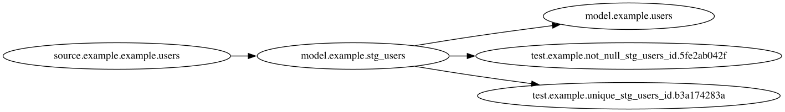

# HotDAG

[](https://pypi.org/project/hotdag)


-----

HotDAG is a lightweight tool that allows for testing for dbt node selectors against dbt project manifests
on a local filesystem, stored on dbt Cloud, or located remotely. Once evaluated, this selection of nodes
can be returned as a list of `unique_id`s, a JSON list of `unique_id`s, or as an SVG of the selection.

**Table of Contents**
- [But Why Though?](#butwhythough)
- [Installation](#installation)
- [License](#license)

## But Why Though?
Sometimes, it can be valuable while developing locally to have a means of quickly testing a selection string against
the production version of a dbt project without fiddling with the generated docs site or compiling the current
production branch. Instead, HotDAG lets you quickly test and visualize your selection using your project's manifest,
whether its on your local file system, stored remotely and accessible via URL, or hosted on dbt Cloud.

## Installation

```console
pip install hotdag
```

## Getting Started
There are a few primary ways to use HotDAG. The most common way is to load a local manifest file and list the
selection. This is roughly equivalent to using `dbt ls`

```console
hotdag --input file --file targets/manifest.json --select "resource_type:source+"

source.example.example.users
model.example.stg_users
model.example.users
test.example.not_null_stg_users_id
test.example.unique_stg_users_id
```

HotDAG really shines, however, if you want to see a diagram of the selection.

```console
hotdag --input file --output svg \
    --file targets/manifest.json \
    --select "resource_type:source+"
```


Also of use is the ability to directly reference the latest manifest from your project's dbt Cloud
job. For example:

```console
hotdag --input dbt_cloud --output svg \
    --account-id 1234 --job-id 9876 \
    --select "resource_type:source+"
```

## Roadmap
- [ ] Styling the SVG output to better distinguish between node types.
- [ ] Improved error handling for remote resource failures.
- [ ] Add rational defaults (e.g. default input to `file` and `--file` to the targets directory)
- [ ] Verify support for Selectors (as defined in yaml)

## License

`hotdag` is distributed under the terms of the [MIT](https://spdx.org/licenses/MIT.html) license.
